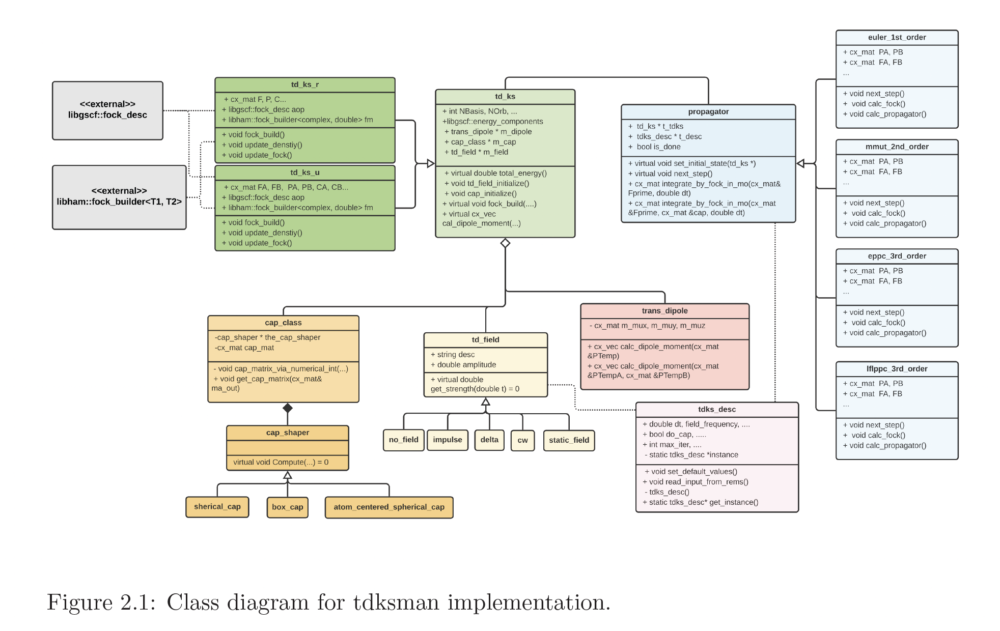
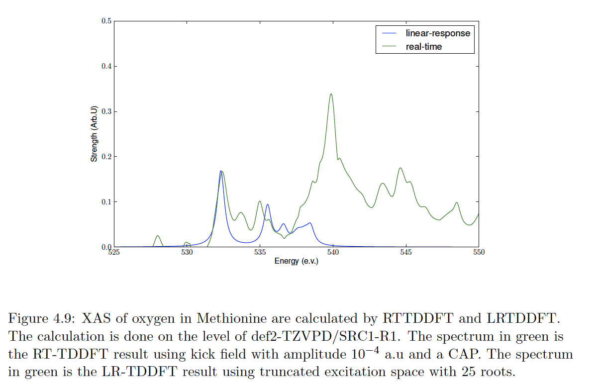
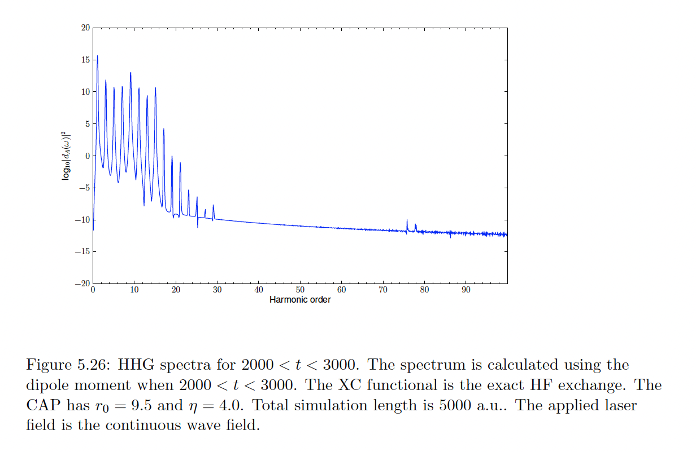

# quantum-tdks-project
Software Development and research for novel spectrum /quantum dynamics calculations using the real-time time-dependent density functional theory (rt-tddft/tdks).
<h3>class diagram</h3>

<h3>Example 1: calculate the xray spectrum for molecules</h3>

<h3>Example 2: calculate the high-harmonic generation for molecules in the strong laser field</h3>

